# ClaudeDeck

**English** · [Türkçe](README.tr.md) · [Website](https://codemagnet-ltd.github.io/claudeDeck/)

**A native macOS app for running Claude Code sessions across many projects from one window.**

See at a glance which session is working, which one needs permission, which one is asking a question
and which one is done and waiting for you. Allow a permission prompt right from the notification,
put sessions side by side, and pick up exactly where you left off after a restart.

ClaudeDeck doesn't wrap, imitate or screen-scrape Claude. Every session runs **your own installed
`claude` CLI** through your login shell, in an embedded terminal (SwiftTerm, a real pty). Your settings,
`CLAUDE.md` files, remote control, MCP servers, skills and other hooks keep working exactly as before.

## Screenshots

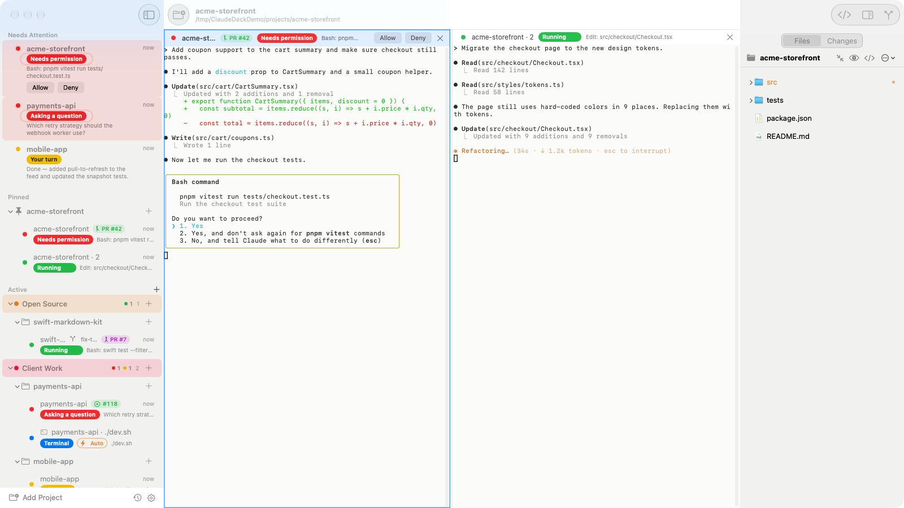

**One window for every session.** Here's what the screenshot shows:
- **Sidebar (left):** every project and session, grouped. Anything that needs you is pulled up into
  **Needs Attention** at the top. `PR #42` and `#118` are linked GitHub pull requests and issues,
  colored by their state.
- **Two panes (middle):**
  - On the left, a session waiting for permission to run a Bash command. You can answer with
    **Allow / Deny** in the pane header, or in the terminal as usual.
  - Next to it, a second session in the same project, still running.
- **Right panel:** switches between **Files** (the selected project's live file tree) and **Changes**
  (source control).

<table>
  <tr>
    <td width="40%" valign="top">
      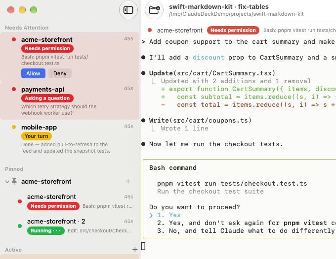
    </td>
    <td valign="top">
      <b>Needs Attention.</b> Sessions that are waiting on you, most urgent first:
      <ul>
        <li>🔴 <b>Needs permission</b>, with the exact command and one-click Allow / Deny.</li>
        <li>🔴 <b>Asking a question</b>, with the question itself.</li>
        <li>🟡 <b>Your turn</b>: Claude finished, with its last message, until you've looked at it.</li>
      </ul>
      The same prompts arrive as macOS notifications with Allow / Deny buttons, on the Dock badge and in the menu bar.
    </td>
  </tr>
  <tr>
    <td width="40%" valign="top">
      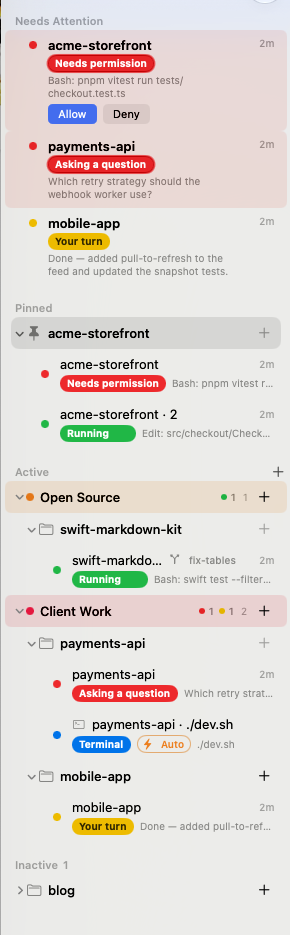
    </td>
    <td valign="top">
      <b>Projects, groups and every state at a glance.</b>
      <ul>
        <li><b>Pinned</b> projects stay on top.</li>
        <li><b>Active</b> lists what's running, in the order you started it, with colored groups (<i>Open Source</i>, <i>Client Work</i>) and live counters.</li>
        <li><b>Inactive</b> folds away projects with nothing running.</li>
        <li>Each row shows the state, what Claude is doing right now and how long ago it changed.</li>
        <li>The branch icon marks a worktree session (<code>fix-tables</code>).</li>
        <li><b>Terminal</b> with <b>⚡ Auto</b> is a plain shell whose startup command (<code>./dev.sh</code>) runs when the app opens.</li>
      </ul>
    </td>
  </tr>
  <tr>
    <td width="40%" valign="top">
      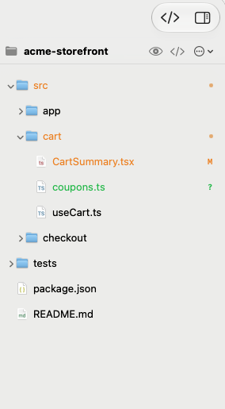
    </td>
    <td valign="top">
      <b>Files panel (⌘⇧E).</b> The project's file tree, updated live, with git marks:
      <ul>
        <li>Orange <b>M</b>: modified. Green <b>A/?</b>: new. Folders with changes get a dot. Files your <code>.gitignore</code> ignores stay hidden.</li>
        <li>Select a file to see its commit history and diffs, including uncommitted changes.</li>
        <li>Drag a file into a Claude pane to add it as <code>@path</code>. Drag files onto a folder to move them, or drop them in from Finder.</li>
        <li><b>Files | Changes</b> at the top of the panel switches it to source control (see the main screenshot).</li>
      </ul>
    </td>
  </tr>
  <tr>
    <td width="40%" valign="top">
      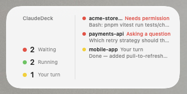
    </td>
    <td valign="top">
      <b>Desktop widget.</b> Counts of sessions waiting, running and done, plus the first sessions that need you with what they're asking. Click a session to jump straight to it. Add it from the desktop: right-click › Edit Widgets… › ClaudeDeck.
    </td>
  </tr>
</table>

<table>
  <tr>
    <td width="50%" valign="top">
      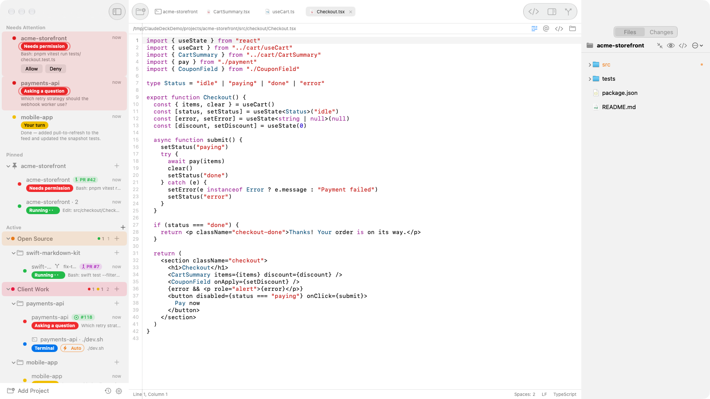
    </td>
    <td valign="top">
      <b>Tabs and the built-in editor.</b> Files open as tabs in the toolbar, next to <b>Sessions</b>, which is always the first tab (it shows the focused session's name):
      <ul>
        <li>A light code editor with syntax colors, line numbers, find and replace, and ⌘S.</li>
        <li><b>Add to Claude</b> (<code>@</code> in the path bar) inserts <code>@path</code> into the selected session, or <code>@path#L10-20</code> when lines are selected.</li>
        <li>Files opened from Quick Open or Changes use a preview tab (in italics) that the next one replaces. ⌘1 to ⌘9 and ⌃Tab switch tabs.</li>
      </ul>
    </td>
  </tr>
  <tr>
    <td width="50%" valign="top">
      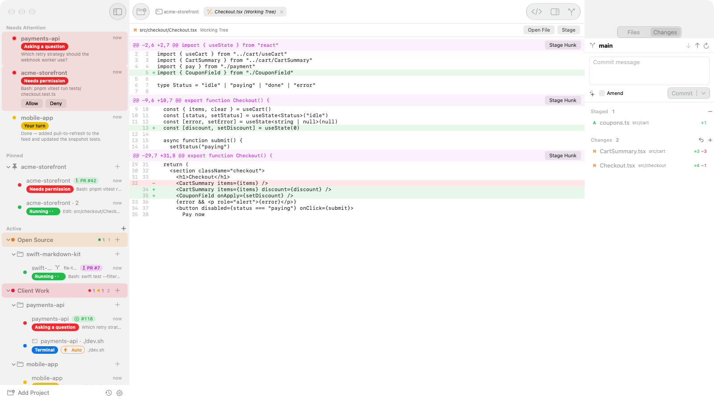
    </td>
    <td valign="top">
      <b>Changes (⌘⇧G).</b> Source control for the selected project:
      <ul>
        <li>Stage, unstage and discard per file or per hunk. Each diff opens as a full-width tab.</li>
        <li>Commit, amend, push and pull. The ✨ button asks your <code>claude</code> to write the commit message.</li>
        <li>Right-click a diff line › <b>Ask Claude about This Line…</b> sends <code>@path#L12</code> and your question to the session.</li>
      </ul>
    </td>
  </tr>
  <tr>
    <td width="50%" valign="top">
      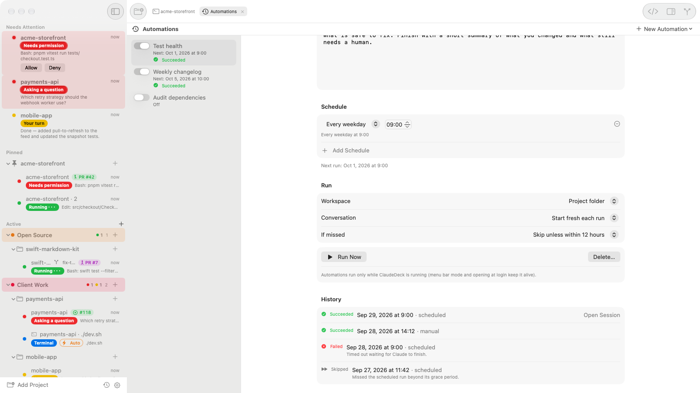
    </td>
    <td valign="top">
      <b>Automations.</b> Saved prompts that start a Claude session on a schedule:
      <ul>
        <li>Every hour, every day, every weekday or every week, or only with <b>Run Now</b>.</li>
        <li>Run in the project folder or in a fresh git worktree each time. Templates to start from.</li>
        <li>A history of every run, with a link to its session. Permission prompts show up in Needs Attention like any other session.</li>
      </ul>
      Automations run only while ClaudeDeck is running.
    </td>
  </tr>
  <tr>
    <td width="50%" valign="top">
      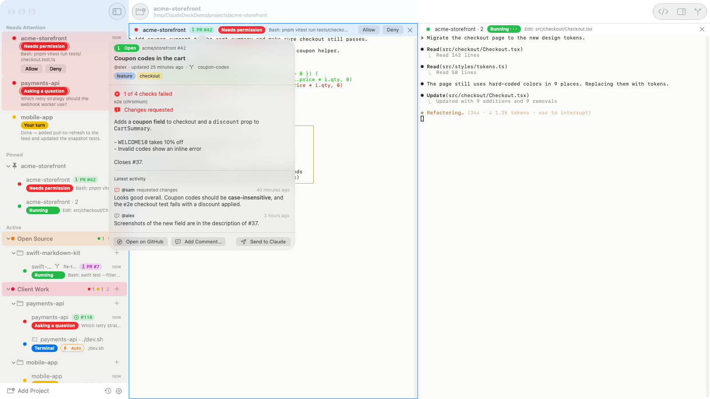
    </td>
    <td valign="top">
      <b>GitHub issues and pull requests.</b> Link one to a session and its badge shows the state:
      <ul>
        <li>The popover has the description, labels, CI checks, reviews and the latest comments.</li>
        <li><b>Send to Claude</b> types the link into the session. <b>Add Comment…</b> posts to GitHub.</li>
        <li>You get a notification when a review arrives, CI fails or the pull request is merged.</li>
      </ul>
      Uses your own <code>gh</code> CLI and its login; ClaudeDeck stores no tokens.
    </td>
  </tr>
  <tr>
    <td width="50%" valign="top">
      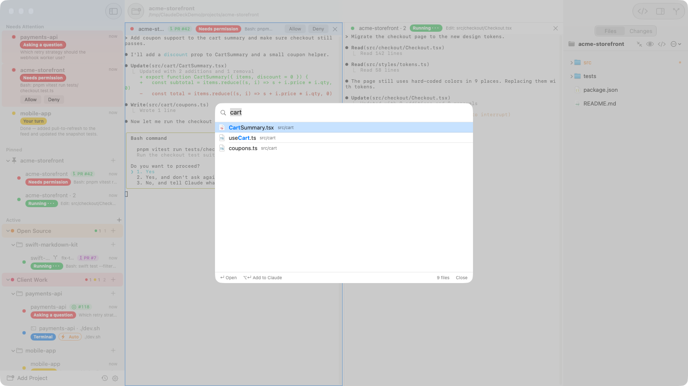
    </td>
    <td valign="top">
      <b>Quick Open (⌘P) and Find in Files (⌘⇧F).</b> Jump to any file in the project by typing part of its name. ↩ opens it, ⌥↩ adds it to Claude as <code>@path</code>. Find in Files searches the contents, untracked files included.
    </td>
  </tr>
</table>

<table>
  <tr>
    <td>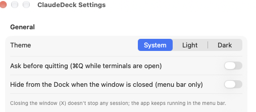</td>
    <td>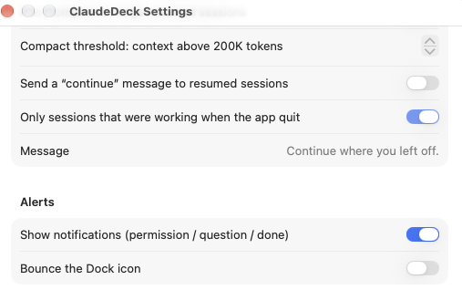</td>
  </tr>
  <tr>
    <td valign="top"><b>Settings › General:</b> System / Light / Dark theme, a confirmation before quitting while terminals run, and a menu-bar-only mode when the window is closed.</td>
    <td valign="top"><b>Settings › Sessions and Alerts:</b> the token threshold for automatic <code>/compact</code>, an optional "continue" message after an automatic resume, and notification options.</td>
  </tr>
</table>

<sub>Screenshots use the built-in demo mode (<code>tools/demo.sh</code>) with made-up projects, repositories and people.</sub>

## What it is, and what it isn't

| ClaudeDeck **is** | ClaudeDeck **is not** |
|---|---|
| A **session manager** that runs your installed `claude` CLI in real terminals | A chat client or API client that replaces Claude Code |
| A dashboard that learns session state from Claude Code's official **hooks** | A tool that reads the screen, parses terminal output or logs keystrokes |
| A local macOS app that gathers many projects and parallel sessions in one window | A cloud service, an account system or telemetry: nothing leaves your Mac |
| A shell around your own settings, `CLAUDE.md` files, MCP servers and skills | A plugin that changes Claude Code's behavior, permission rules or model |
| A shortcut that sends the key *you* would press to a permission prompt | An automation that approves permissions on its own |

Billing, usage limits and sign-in stay entirely with Claude Code. ClaudeDeck doesn't touch them.

## Highlights

- 🟢🔴🟡 **Live status:** running, needs permission, asking a question, or your turn, for every session.
  The state comes from Claude Code hooks, not from reading the screen.
- 🔔 **Notifications, Dock badge, menu bar item and a desktop widget**, so you never miss a session
  that needs you.
- ✅ **Allow or Deny from the app:** from the notification, the list or the pane header.
- 🗂 **Projects and groups:** pin projects, use colored groups, and sessions that need attention float to the top.
- 🪟 **Side-by-side panes:** drag and drop up to four sessions next to each other.
- ♻️ **Persistence:** open sessions come back with `claude --resume` after a restart and carry on as
  they were. Optionally (Settings, off by default) `/compact` is sent when the context has grown too large.
- 🌿 **Worktree sessions:** run parallel sessions in the same project, each in its own
  `claude --worktree`, so they never edit the same files.
- 📁 **Files panel:** a live file tree with git status marks, per-file history and diffs, Quick Open (⌘P)
  and Find in Files (⌘⇧F). Drag a file into a terminal to add it as `@path`.
- 📑 **Tabs and a built-in editor:** files, diffs and Automations open as tabs next to your sessions. A light
  code editor with syntax colors, find and replace, and "Add to Claude" for `@path#L10-20`.
- 🔀 **Changes (⌘⇧G):** stage, unstage and discard by file or hunk, commit, push and pull, with a commit
  message written by Claude.
- 🐙 **GitHub links:** attach an issue or pull request to a session and see its state, reviews and CI;
  get notified when they change. Uses your `gh` CLI.
- ⏰ **Automations:** scheduled prompts (hourly, daily, weekdays, weekly) with Run Now and a run history.
- 🔄 **Restart Session (⌥⌘R):** quits `claude` and resumes the same conversation, so new MCP servers and
  settings take effect.
- ✏️ **Pencil (pen.dev):** sessions ClaudeDeck starts can use Pencil's design tools, and `.pen` files open in Pencil.
- 💻 **Plain terminals:** a shell in the project folder, optionally with a startup command such as
  `yarn start` that runs when the app launches.
- ☁️ **iCloud sync (optional):** your project list and groups stay in sync across your Macs.
- 🎨 Light and dark themes, terminal zoom (⌘+ / ⌘- / ⌘0), and ⌘V to paste images into Claude.
- 🌐 **English and Turkish.** The app follows your system language. To choose one just for ClaudeDeck,
  go to System Settings › General › Language & Region › Applications.

## Install

1. Download the latest `ClaudeDeck-<version>.dmg` from [Releases](../../releases/latest).
2. Open the DMG and drag **ClaudeDeck** into **Applications**.
3. Launch it. On first launch the Claude Code hook is added to `~/.claude/settings.json`
   (a backup is made first; see below).

The app is signed with a Developer ID and notarized by Apple, so Gatekeeper won't warn you.

### Requirements

- macOS 15 (Sequoia) or later
- [Claude Code](https://docs.claude.com/en/docs/claude-code) installed, with `claude` available in your login shell
- `jq`, which ships with macOS 15 as `/usr/bin/jq`
- Optional:
  - Git status marks and file history need the Command Line Tools (`xcode-select --install`) or Homebrew git.
    Without either, these features stay off quietly.
  - Opening files in an external editor needs VS Code, VS Code Insiders or VSCodium. The built-in editor
    needs nothing.
  - GitHub links need the [GitHub CLI](https://cli.github.com) (`gh`), signed in with `gh auth login`.
  - The Pencil integration needs the Pencil desktop app from [pen.dev](https://pen.dev).

## How status works (no screen reading)

1. On first launch, the ClaudeDeck hook is **added** to `~/.claude/settings.json`:
   - A `settings.json.claudedeck-backup-<time>` backup is made first.
   - Your other hooks are left alone, and the hook is never added twice.
   - Symlinked settings files keep their link.
   - To undo it, go to Settings › Claude Code hooks › Uninstall.
2. The hook is `~/.claude/deck/bin/deck-hook.sh`: plain `sh` plus `/usr/bin/jq`, about 40 ms per event.
   - It only acts in terminals ClaudeDeck opened, which carry `CLAUDEDECK_TERMINAL_ID`, and does nothing
     for `claude` running anywhere else.
   - It writes `~/.claude/deck/sessions/<session_id>.json` atomically.
3. The app watches that folder with a DispatchSource (no polling) and cleans up stale files.
4. Esc interrupts and permission denials don't fire hooks, so they are picked up instantly from the
   session transcript's `[Request interrupted by user…]` entry instead.
5. Parallel tools: while a permission prompt is open, another tool finishing doesn't flip the state
   back to "running".

| Event | State |
|---|---|
| UserPromptSubmit, PreToolUse, PostToolUse(Failure), permission answered | 🟢 Running |
| PermissionRequest, Notification `permission_prompt` | 🔴 Needs permission |
| AskUserQuestion (PermissionRequest/PreToolUse), Notification `elicitation_dialog` | 🔴 Asking a question |
| Stop, StopFailure, Notification `idle_prompt`, interrupt/deny in transcript | 🟡 Your turn |
| SessionEnd / process exited | ⚪️ Stopped |

## Features

### Sessions
- **New Claude session:** use the **+** on a project header, the context menu, or ⌘T. You can run as
  many sessions per project as you like.
  - Names come from the project (`claude --name "<project>"`, then `"<project> · 2"`) and show up in
    remote control too.
  - Renaming is forwarded to the running session with `/rename`.
- **Resume a previous conversation:** project menu › Resume Previous Conversation…, which lists
  transcripts from `~/.claude/projects`.
- **Persistence:** sessions that were open when you quit come back on launch with
  `claude --resume <id>`.
  - Selecting a stopped session resumes it.
  - Sessions you closed with `/exit` or End Session come back when you choose Resume.
- **Auto /compact (off by default):** when turned on, `/compact` is sent to a resumed session whose context is above the threshold.
  - The threshold is measured in real context tokens: `input + cache_read + cache_creation` of the last
    assistant message, not the transcript file size.
  - Configurable in Settings: 50K to 1M tokens, 200K by default.
- **Separate worktree:** project menu › New Claude Session (Separate Worktree)…, available in git repos only.
  - Runs `claude --worktree <name>` in its own git worktree.
  - The real folder is learned from the hooks' `cwd`, and resuming runs there.
- **Restart Session (⌥⌘R):** quits the session's `claude` and starts it again in the same pane, resumed
  into the same conversation. Use it after adding an MCP server or changing settings or `CLAUDE.md`.
  - File › Restart All Claude Sessions does it for every running Claude session. It asks before
    interrupting sessions that are working, and can skip them.
  - On a plain terminal, Restart Terminal runs the shell and its startup command again.
- **Context menu:** Open Beside / Close Pane, Allow / Deny (when waiting), End Session, Resume,
  Restart Session, Start Fresh, Rename, Link GitHub Issue or PR…, and End and Remove. End and Remove asks
  first and never deletes Claude's history.

### Plain terminals
- Open one with the terminal icon on a project header, context menu › New Terminal, or ⌥⌘T. It starts
  a login shell in the project folder.
  - Terminals show a blue "Terminal" tag and the current terminal title.
  - They don't count toward status or notifications.
- **Startup command** (e.g. `yarn start`): typed and run every time the terminal opens.
  - It stays in history, and Ctrl+C doesn't close the terminal.
- **Start when the app launches:** on by default for terminals with a startup command.

### Permissions and notifications
- **Notifications** for permission prompts, questions and finished turns, with the tool and its
  command or file.
  - Skipped when that terminal is already visible, and for things you did yourself, like Esc or Deny.
  - Clicking one brings the app forward and selects that session.
- **Allow / Deny** appears in the notification, the Needs Attention row, the pane header and the context menu.
  - The app types the key you would press (Allow = `1`, Deny = Esc).
  - It only sends it if the session is still waiting on the same prompt.
  - Questions and plan approval (ExitPlanMode) are excluded.
- **Dock:** the badge shows how many sessions are waiting. The icon bounces until you return for a
  permission prompt or question, and once when a session finishes.
- **Menu bar:** waiting, running and your-turn counters. Click for the session list.
- **Widget:** right-click the desktop › Edit Widgets… › ClaudeDeck. The app must have been opened at
  least once.
  - Small size shows the counters; medium shows the first four sessions that need attention.
  - Clicking one opens that session (`claudedeck://session/<uuid>`).

### Sidebar
- **Needs Attention:** sessions asking for permission, asking a question, or finished but not yet seen
  sit at the top with project name and message. Permission prompts are highlighted in red.
- **Status tags:**
  - 🟢 Running (flowing dots)
  - 🔴 Needs permission / Asking a question (pulsing)
  - 🟡 Your turn
  - ⚪️ Stopped
  - 🔵 Terminal

  A row briefly glows when its state changes.
- **Projects:** "Pinned" and "Projects" sections.
  - Groups sit inside "Projects" like folders.
  - Projects and groups with waiting or active sessions move up, and ones with a waiting session expand
    automatically.
  - Clicking a project opens its latest session and points the Files panel at it.
- **Groups:** "Projects" header **+** › New Group….
  - Assign several projects at once with Choose Projects….
  - Change a group's color and name from its context menu.

### Side-by-side panes
- Open a session next to another one in any of these ways:
  - Drag it onto the left or right half of the terminal area.
  - Use context menu › Open Beside.
  - Open all of a project's sessions side by side from its menu.
- Up to four panes; drag the divider to resize.
- Each pane header shows the name, state, Allow/Deny, and ✕. ✕ only closes the pane; the process keeps running.
- The layout persists.

### Tabs
- The toolbar shows tabs in place of the window title once anything besides Sessions is open:
  - **Sessions** is always the first tab (⌘1), titled with the focused session's name: the sidebar's
    sessions and panes, as before.
  - **Files** open in the built-in editor, **diffs** from Changes open full width, and **Automations** has its own tab.
- **Preview tabs:** files opened from Quick Open or Find in Files, and diffs clicked in Changes, open in a
  preview tab (in italics) that the next one replaces. Editing it, or choosing Keep Open, keeps it.
  Double-click in the Files panel opens a permanent tab.
- ⌘1 to ⌘9 select tabs, ⌃Tab / ⌃⇧Tab move between them, ⌘W closes the current tab. Drag tabs to reorder them.
- Tab menu: Close Tab, Close Other Tabs, Close Tabs to the Right, Open in Separate Window, Copy Path,
  Reveal in Finder.
- Open tabs come back after a restart. Settings › Editor › "Open files in separate windows instead of tabs"
  gives every file its own window instead.

### Built-in editor
- Double-click a text file in the Files panel (or pick Open in Editor) to edit it. Quick Open, Find in Files
  and Changes open files the same way.
- Syntax colors for Swift, JavaScript/TypeScript, JSON, Python, Go, Rust, shell, YAML, Markdown, HTML/XML,
  CSS and C-family files. Line numbers, auto-indent, wrap lines, and the standard find bar with replace (⌘F).
- ⌘S saves; closing a tab or quitting with unsaved changes asks first.
- If the file changes on disk (for example, Claude edits it), the editor reloads it. With unsaved edits of your
  own, a bar offers **Reload** or **Keep Mine**.
- **Add to Claude** inserts `@path` into the selected session, or `@path#L10-20` with the selected lines.
- Settings › Editor: font size, wrap lines, and whether double-click uses the built-in editor at all. Files
  over 8 MB and binary files open in their default app.

### Changes (⌘⇧G)
- The right panel's **Changes** side (or ⌘⇧G) shows the selected project's branch, staged and unstaged files,
  and conflicts. It updates as files change.
- Click a file to open its diff as a full-width tab. Stage, unstage or discard a whole file, every file, or a
  single hunk. Discarding asks first; new files go to the Trash.
- **Commit** with an optional **Amend**, or Commit & Push. Push, pull (fast-forward only) and Publish Branch.
- ✨ **Generate Commit Message:** your `claude` (`claude -p`) reads the staged diff and writes the message.
- Right-click a line in a diff › **Ask Claude about This Line…** sends `@path#L<line>` with your question
  to the selected session. Copy Line and Open File are in the same menu.

### Files panel (⌘⇧E)
- A live tree of the last clicked project, or the selected session's worktree.
  - It follows changes on disk as they happen (FSEvents), including git operations.
  - Files your `.gitignore` ignores, plus `.git`, `node_modules`, `.build` and the like, are hidden. The eye
    icon shows hidden files; the ⋯ menu shows ignored ones.
- **Git:**
  - Modified files are shown as orange **M**, new ones as green **A/?**, deleted or conflicted ones in red.
    Folders containing changes are dotted.
  - Selecting a file shows its commit history. Click a commit for the file's diff; uncommitted changes
    are at the top.
- Click to select (⌘-click for several). Double-click opens the file in VS Code, or in the default app if
  VS Code isn't installed.
- **Context menu:** Open in Editor, Open in VS Code, Open, Reveal in Finder, Add to Claude (`@path`), Copy Path,
  Copy Relative Path, New File / New Folder, Rename, Duplicate, Cut / Copy / Paste, Move to Trash.
- Drag files onto a folder to move them, or drop files from Finder to copy them into the project.
- **Quick Open (⌘P):** type part of a file name; ↩ opens it, ⌥↩ adds it to Claude.
- **Find in Files (⌘⇧F):** searches file contents with `git grep`, untracked files included. Click a match to
  open the file; ⌥-click adds `@path#L<line>` to Claude.
- **Drag a file onto a terminal pane:**
  - In Claude it's added as `@relative/path`. Images use the full path, so Claude attaches them as images.
  - In a plain terminal the escaped path is typed.

### GitHub issues and pull requests
- Session menu › **Link GitHub Issue or PR…** takes a URL or `owner/repo#123`. **Link PR for Current Branch**
  finds the pull request of the branch the session is on.
- The badge next to the session name shows `PR #42` or `#118` in the item's color: green open, purple
  merged, red closed, grey draft. A dot means it changed since you last looked.
- Click the badge for the title, labels, description, CI checks, review decision and the latest reviews and
  comments. **Send to Claude** types the link into the session; **Add Comment…** posts a comment.
- ClaudeDeck checks linked items every minute while it is in front, and notifies you when a pull request is
  merged or closed, CI fails or passes, a review arrives, or new comments come in.
- Everything goes through your own `gh` CLI and its login. Without `gh`, the popover explains how to set it up.

### Automations
- Open them from the clock button at the bottom of the sidebar, File › Automations… or the menu bar. They open as a tab.
- An automation is a prompt, a project and one or more schedules: every hour at a minute, every day, every
  weekday, or every week at a time. Without a schedule, it runs only with **Run Now**.
- Each run starts a Claude session in the project folder or in a new git worktree, and either starts fresh or
  continues the last run's session.
- Templates: Find critical bugs, Audit dependencies, Test health, Triage TODOs, Weekly changelog.
- **History** lists every run with its status (Succeeded, Failed, Skipped…) and opens its session.
- Automations run only while ClaudeDeck is running. A run the Mac slept through is skipped once it is older
  than the "If missed" limit. Keep the app in the menu bar and open it at login to never miss one.

### Pencil (pen.dev)
- If the Pencil desktop app is installed, new and resumed Claude sessions started by ClaudeDeck get its MCP
  server (via `--mcp-config`), so Claude can work with your designs. Your global Claude configuration is not
  changed.
- A **Pencil** tag in the pane header marks those sessions. Sessions that were already running need a
  Restart Session to pick it up.
- `.pen` files open in Pencil from the Files panel. Turn the integration off in Settings.

### Terminal
- Full keyboard support, colors, shortcuts, resizing and copy/paste. Switching panes or sessions never
  kills processes.
- **Zoom:** ⌘+ / ⌘- / ⌘0 or pinch on the trackpad. The zoom level is remembered.
- **Theme:** System / Light / Dark in Settings; terminal colors follow.
- **⌘V with an image** on the clipboard attaches it to Claude as an image, as Terminal.app does.
  Files copied in Finder are pasted as paths.
- **⌘-click links and paths** in the output: URLs open in the browser; a file path (like
  `promo-video/out/promo.mp4` or `src/app.ts:42`) is resolved against the session's project folder and
  shown in Finder. ⌘⌥-click opens the file itself (text files in the built-in editor).

### Settings (⚙︎ or ⌘,)
- Launch at login (the app must be in `/Applications`).
- Resume sessions on launch, auto /compact and its token threshold.
- Notifications and Dock bounce, theme, and keeping the app in the menu bar when the window is closed.
- Editor: built-in editor on or off, separate windows instead of tabs, font size, wrap lines.
- Pencil: connect Claude sessions to Pencil, with its status.
- iCloud sync (below).
- Claude Code hooks: status, reinstall, uninstall.

## iCloud sync (optional)

Turn it on in Settings › iCloud (off by default). No entitlement is needed; it is a plain file:
`~/Library/Mobile Documents/com~apple~CloudDocs/ClaudeDeck/projects.json`.

- **Synced:** groups (id, name, color) and projects (path, name, group, pinned). Paths under your home
  folder are stored as `~/…`.
- **Not synced:** sessions, panes, selection, settings, expanded state, terminal and Claude ids.
- **Merge:** projects are matched by path and groups by id. Missing items are added, and on conflict
  the most recent change wins.
- **Deletions don't propagate:** an item deleted on one Mac stays on the others. Sync never deletes
  local projects or sessions.

## Data

| What | Where |
|---|---|
| Projects, groups, sessions, panes, settings, GitHub links, automations and their run history | `~/Library/Application Support/ClaudeDeck/deck.json` |
| Open tabs, panel layout | The app's preferences (`defaults read <bundle-id>`) |
| Live session states (written by the hook) | `~/.claude/deck/sessions/<session_id>.json` |
| Hook script | `~/.claude/deck/bin/deck-hook.sh` |
| settings.json backups | `~/.claude/settings.json.claudedeck-backup-<date>` |
| Widget snapshot | `~/Library/Group Containers/<team>.<bundle-prefix>.ClaudeDeck/widget-snapshot.json` |
| iCloud sync (if on) | `~/Library/Mobile Documents/com~apple~CloudDocs/ClaudeDeck/projects.json` |
| Conversation history | Claude's own location, `~/.claude/projects/<project>/<id>.jsonl` (read-only for ClaudeDeck) |

## Building from source

```sh
./build.sh           # release → build/ClaudeDeck.app (with widget and icon)
./build.sh debug     # debug build
./build.sh run       # build and (re)launch
./build.sh install   # build, copy to /Applications/ClaudeDeck.app and launch from there
swift build          # quick SwiftPM-only build (no widget)
swift test           # Core unit tests
xcodegen generate    # generate ClaudeDeck.xcodeproj from project.yml, then open it in Xcode
```

- `build.sh` builds with `xcodegen generate` + `xcodebuild`, because SwiftPM can't build app
  extensions such as the widget.
  - Without `xcodegen` (`brew install xcodegen`) it falls back to plain SwiftPM packaging, with no widget.
- The Xcode project is generated, so don't edit it by hand:
  - Change targets in `project.yml`.
  - Change the team, bundle id and version in `Config/Shared.xcconfig`.
  - On first open, Xcode asks you to "Trust & Enable" SwiftTerm's build plugin.
- UI strings live in string catalogs: `Support/Localizable.xcstrings` for the app and
  `Widget/Localizable.xcstrings` for the widget. Xcode adds new strings when you build in the IDE.
  To add a language, add translations there.
- The app icon is drawn in code: `swift tools/make-icon.swift Support` writes `Support/AppIcon.icns`
  and `Support/Assets.xcassets/AppIcon.appiconset`.

### Building with your own Apple account

The defaults use the official release team. To build on your own Mac:

```sh
cp Config/Local.xcconfig.example Config/Local.xcconfig   # git-ignored
# DEVELOPMENT_TEAM = <your Team ID>      (a free Apple ID's personal team works)
# DECK_BUNDLE_PREFIX = com.yourname      (must differ from the official one)
./build.sh
```

The widget's App Group, the bundle ids and signing are all derived from these two values; nothing in
the code needs changing. Because the signature stays stable, macOS doesn't ask for folder or
notification permissions again after every build.

## Distribution

```sh
./make-dmg.sh    # test DMG from build/ClaudeDeck.app (unsigned)
./notarize.sh    # build → sign with Developer ID → notarize app and DMG → staple → verify
./release.sh     # notarize.sh + v<version> tag + GitHub Release (DMG and SHA-256 attached; asks before publishing)
```

- The version lives in one place: `MARKETING_VERSION` / `CURRENT_PROJECT_VERSION` in `Config/Shared.xcconfig`.
- Notarization needs a **Developer ID Application** certificate and a `notarytool` profile.
  - Both live only in the local keychain; the repository contains no signing keys or passwords.
  - If anything is missing, `notarize.sh` stops with an explanation before building or uploading anything.

## Code layout

- `Sources/ClaudeDeckCore/`: the UI-free, tested layer.
  - Hook script and `settings.json` merging (`HookScript`, `HookInstaller`)
  - State model (`SessionState`, `StatusDirectory`) and transcript reading (`Transcript`)
  - Persistence (`DeckData`)
  - File listing and git (`FileListing`, `Git`, `GitChanges`, `GitExplorer`, `UnifiedDiff`)
  - Tabs (`WorkspaceTabList`), editor text and syntax (`TextFileIO`, `SyntaxTokenizer`)
  - GitHub via `gh` (`GitHub`, `GitHubLink`), automations (`Automations`), restart and Pencil
    (`SessionRestart`, `PencilIntegration`)
  - iCloud (`DeckSync`) and the widget snapshot (`WidgetSnapshot`)
- `Sources/ClaudeDeck/`: the SwiftUI app.
  - `AppModel` and `TerminalRegistry` (SwiftTerm, processes)
  - Views: `SidebarView`, `ContentView` (panes), `WorkspaceTabs` / `TabStrip`, `EditorWindow` /
    `CodeTextView`, `FileBrowser` / `ExplorerSearch`, `ChangesView` / `DiffTab`, `AutomationsView`,
    `GitHubLinkViews`, `MenuBarViews`, `SettingsView`
  - `GitHubMonitor`, `AutomationScheduler`, `AppModel+Restart`, `PencilApp`
  - `AttentionCenter` (notifications, Dock) and `PermissionActions`
  - `WidgetBridge` and `DeckSyncController`
- `Widget/`: the WidgetKit extension. `tools/make-icon.swift`: the icon generator.
- `Tests/ClaudeDeckCoreTests/`: unit tests, including the real hook script against a real git repository.

## Development notes

### Demo mode

`./build.sh && tools/demo.sh` launches the app with made-up projects, groups and sessions in every state.
Use it for screenshots.
- The data lives in `/tmp/ClaudeDeckDemo` and is recreated on every run.
- Sessions run `tools/demo-claude.sh`, a stand-in that prints a canned conversation and reports a fixed
  state, instead of the real `claude`.
- GitHub links are answered by a stand-in `gh` that reads fixture files (made-up `acme/*` repositories).
  The demo also has automations with a run history, and staged and unstaged changes in `acme-storefront`.
- Demo mode never touches `~/.claude/settings.json`, your `deck.json` or iCloud.

### Snapshot mode


`CLAUDEDECK_SNAPSHOT_DIR=<dir> open build/ClaudeDeck.app` enables end-to-end testing without the Screen
Recording permission:
- It periodically renders the windows to PNG and writes table row counts to `rows.txt`.
- It processes command files in `<dir>`:
  - `<session>.in` types text into that terminal (`<CR>`, `<ESC>` are supported).
  - `<session>.select`, `<session>.beside`, `<session>.paste`, `<session>.approve` / `.deny`,
    and `<project>.shell` trigger the matching actions.
  - `<name>.tab` opens a tab: `file<TAB><path><TAB><preview 0|1>`, `diff<TAB><repo><TAB><path><TAB><staged 0|1>`,
    `automations`, `sessions`, or `close-all`.
  - `<name>.inspector` (`files`, `changes`, `hide`), `<name>.quickopen` (the query), `<session>.github`
    (fetch its link) and `<session>.popover` (open the link popover).
  - `<name>.frame` (`x y w h`, screen points) sizes the main window, `<name>.scroll` (`x y` in the window)
    scrolls the view there to its end, and `app.quit` quits.
  - Together with `screencapture -l <window id>` this takes screenshots without any clicks or keystrokes.
- The Liquid Glass sidebar renders blank in these snapshots; use `rows.txt` for it.

## License and legal

[MIT](LICENSE) © 2026 [CODE MAGNET YAZILIM LTD. ŞTİ.](https://codemagnet.co)
Third-party licenses: [Support/THIRD_PARTY_LICENSES.txt](Support/THIRD_PARTY_LICENSES.txt) (SwiftTerm, MIT).

ClaudeDeck is an independent open-source project. It is not affiliated with, endorsed by or sponsored
by Anthropic. "Claude" and "Claude Code" are trademarks of Anthropic PBC.
